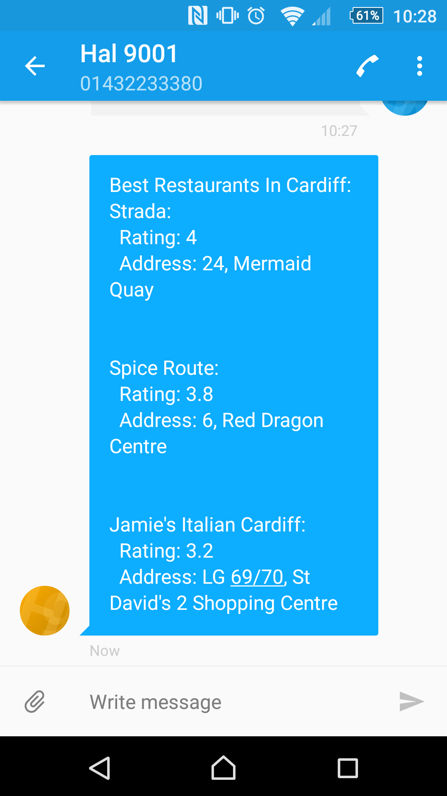

#Hal

#####Meet Hal - your friendly SMS-based information engine.

Ever wanted to Google who Alan Turing was, but you can't because your internet bundle's too stingy to let you start a couple of days early? Been on holiday, where learning the capital of Peru over roaming data costs £9.99 plus tax? (It's Lima, by the way.) Or maybe your phone just hasn't been rocketed into the 21st Century yet, and even currency conversion makes it overheat?

***Worry no more - Hal is here to help.***

Hooking into Google Places, Wikipedia, WordsAPI, Google's currency conversion tools and much more coming soon, Hal can get you out of a scrape.

Want to know the best places around for a cracking meal? No problem - text it `best restaurants in Cardiff` (or wherever you happen to be) and it'll send you back something that looks like this:

Writing the latest spy thriller, but you don't want to keep using the word 'suddenly'?

Can't for the life of you remember what Charles Darwin did?

Or want to buy something snazzy in Tokyo?

***Hal's getting smarter every day, so watch this space for more!***
